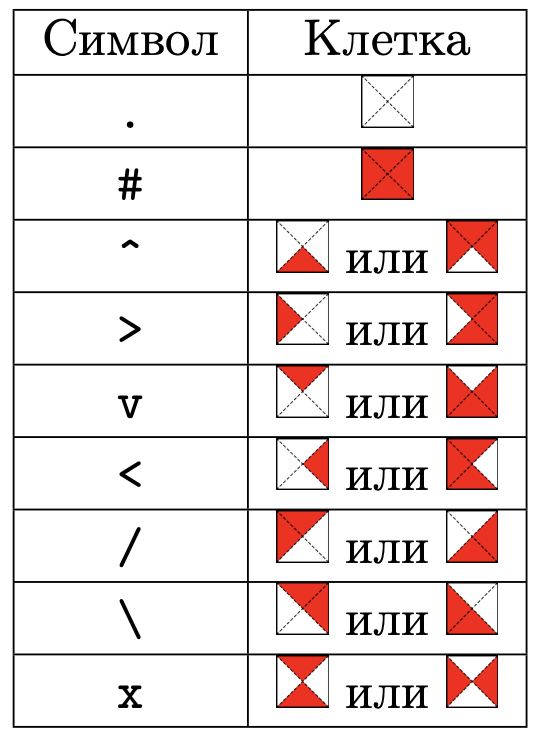

# Оригами

## Условие задачи
В компании Nozo решили украсить офис с помощью фигурок из бумаги — оригами. Офис у компании очень большой, поэтому проектирование различных форм оригами решили автоматизировать. И, конечно же, эту работу поручили сделать именно вам.

Дана форма клетчатого листа бумаги — основы для оригами. Обратите внимание, лист бумаги может быть не прямоугольным. Лист бумаги вводится как таблица из `n * m` символов. Каждая ячейка таблицы может содержать или не содержать участок листа. Гарантируется, что все символы таблицы равны `«#»` или `«.»`.
Все остальные символы появляются в процессе складывания оригами. Лист может быть несвязным, также внутри листа могут быть `«дырки»`.

Таким образом, по данной таблице можно восстановить исходный лист единственным образом. Но в процессе складываний листа бумаги вам могут понадобиться дополнительные символы для обозначения клеток, которые заполнены участком листа частично. На рисунке `1` представлен список символов и соответствующих им обозначений. В них красным цветом показано, как участок листа заполнил клетку, а белым — пустое пространство.

Рисунок `1`:

С этим листом бумаги проводится некоторое количество операций складывания. Для каждой операции выбирается прямая: горизонтальная, вертикальная или диагональная. Все участки бумаги, что находятся с правой стороны от прямой, отражаются относительно этой прямой и перекладываются на левую сторону от этой прямой. Прямая обозначается двумя точками. Участок бумаги находится по правую сторону от прямой если он находится по правую сторону от луча, проведенного от первой из данных точек ко второй. Прямая может быть проведена по границе листа.

## Входные данные
Каждый тест состоит из нескольких наборов входных данных.

Первая строка содержит целое число `t (1 ≤ t ≤ 100)` — количество наборов входных данных.

Далее следуют описания наборов входных данных.

Первая строка каждого набора входных данных содержит три целых числа `n`, `m` и `k` `(1 ≤ n, m, k ≤ 10)`, где `n` и `m` — размеры поля с оригами, а `k` — количество операций.

Следующие `n` строк каждого набора входных данных содержат по `m` символов `«.»` и `«#»` — само оригами. Гарантируется, что оригами заключено в минимально возможную таблицу, то есть в первой и последней строке, а также в первом и последнем столбце таблицы есть хотя бы один символ `«#»`.

В следующих `k` строках вводятся описания прямых, относительно которых необходимо проводить операции с оригами. Прямая задаётся двумя числами — индексами точек, расположенных на краю таблицы. Точки с целыми координатами на краю листа нумеруются с единицы, начиная с верхнего левого угла таблицы по часовой стрелке.

Группы тестов: в первой группе тестов во входных данных нет символов `«.»`, то есть оригами — это прямоугольник. С ним производится ровно одна операция относительно некоторой вертикальной или горизональной, но не диагональной прямой.

Во второй группе тестов с оригами производятся операции относительно некоторых вертикальных или горизональных, но не диагональных прямых.

В третьей группе тестов дополнительных ограничений нет.

Обратите внимание, примеры из условия могут не совпадать с первыми тестами в системе и архиве.

## Выходные данные
После каждой операции выведите получившееся оригами. Выводите оригами заключённым в минимально возможную таблицу, то есть в первой и последней строке, а также в первом и последнем столбце вашей таблицы должен быть хотя бы один символ, не равный `«.»`. После вывода очередного оригами выводите пустую строку. Не выводите никакие лишние символы.